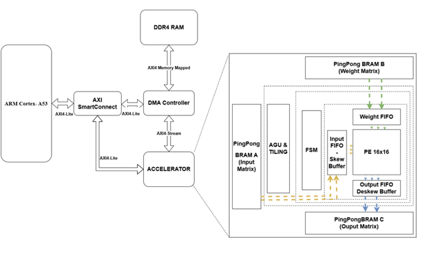
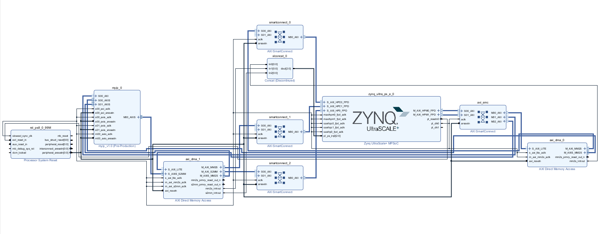
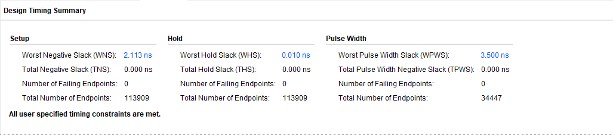
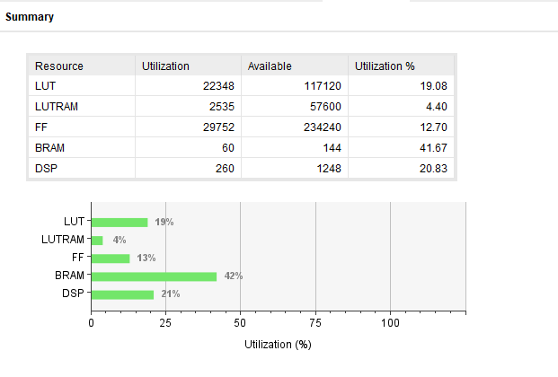
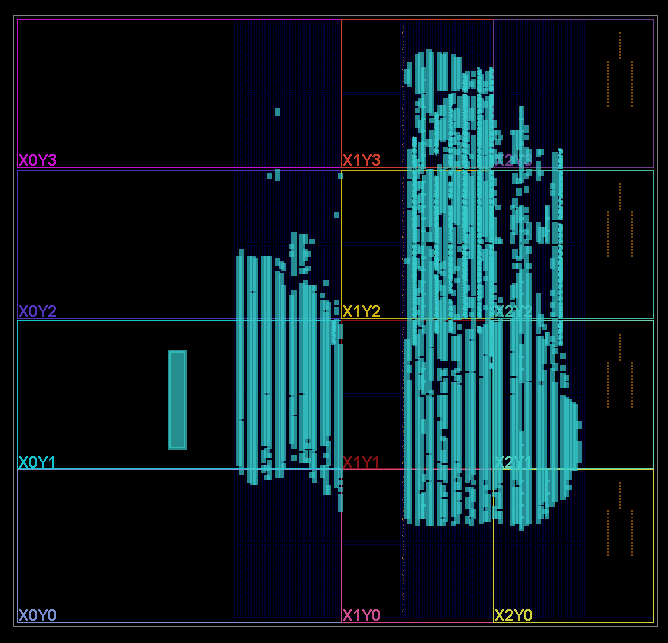
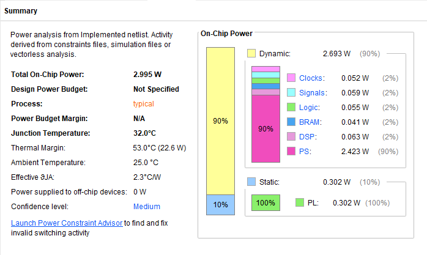
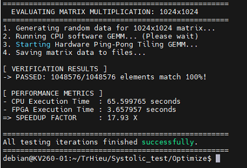

# FPGA-Based GEMM Accelerator: Systolic Array & Ping-Pong Pipelining

This repository contains the complete hardware/software co-design for a custom **Matrix Multiplication (GEMM) Accelerator**. Deployed on the Xilinx Kria KV260 Vision AI Starter Kit, the system features a 16x16 Systolic Array core, a Dual AXI DMA architecture, and a high-performance Linux Userspace Driver implementing an asynchronous Ping-Pong buffer pipeline to completely hide memory transfer latency.

## Core Features

* **16x16 Systolic Array Architecture**: A highly optimized processing element (PE) grid designed for high-throughput Multiply-Accumulate (MAC) operations.
* **Hardware-Constrained Tiling (64x64)**: Built to map large-scale matrices onto a fixed $64 \times 64$ BRAM fabric, utilizing custom software tiling to overcome local memory size limitations.
* **Dual AXI DMA Network**: Eliminates bus bottlenecks. `axi_dma_0` handles Input matrices (MM2S), while `axi_dma_1` parallelly handles Weights (MM2S) and Output results (S2MM).
* **Asynchronous Ping-Pong Pipelining**: The ARM CPU pre-fetches and pre-loads the next data tile into a standby memory bank while the FPGA computes the current bank. This ensures 100% hardware utilization.
* **Linux Userspace Driver (UIO)**: Achieves zero-copy bypass by mapping physical addresses directly to the C application, utilizing ARM Assembly (`dmb ish`) for strict hardware memory synchronization.
* **Zero-Padding Logic**: Automatically applies zero-padding to edge-case matrix tiles to ensure alignment with systolic array dimensions without inducing computational errors.


---

## System Architecture

The accelerator integrates the custom Systolic IP with the Zynq UltraScale+ processing system via a high-speed AXI-Stream interface.



---

## Built With

* **Hardware Description Language**: Verilog (IEEE 1364-2005)
* **EDA Tool**: Xilinx Vivado 2025.1
* **Firmware/Drivers**: C (Linux Userspace Application)
* **Target Platform**: AMD/Xilinx Kria KV260 Vision AI Starter Kit
* **OS**: PetaLinux (ARM Cortex-A53)

## Repository Structure

* `/bd`: Vivado Block Design files and SoC wrappers.
* `/custom_ip`: Packaged custom AXI IP.
* `/EmbeddedCodeC`: The main Linux Userspace software stack (UIO driver & execution loop).
* `/rtl`: Core hardware Verilog source code.
* `/scripts`: Tcl scripts for automated project generation.
* `/tb`: RTL verification testbenches.

---

## Installation & Usage

**1. Clone the repository:**
```bash
git clone [https://github.com/YourUsername/YourRepoName.git](https://github.com/YourUsername/YourRepoName.git)
cd YourRepoName

```

**2. Rebuild the Vivado Project:**
You can restore the project using the Vivado Command Line Interface (recommended):
```bash
vivado -mode batch -source scripts/build_project.tcl

```
Alternatively, you can open the Vivado GUI, navigate to the Tcl Console, cd into the cloned repository, and type source scripts/build_project.tcl.

**3. Deploy on Target Board (KV260):
Load the generated bitstream into the FPGA fabric using the xmutil tool or your preferred FPGA manager on Ubuntu.
**4. Execution:**
Navigate to `EmbeddedCodeC`, compile, and run on the KV260:

```bash
cd EmbeddedCodeC
gcc -O3 run.c FPGA_Driver.c -o gemm_accel
sudo ./gemm_accel

```
**5. Execute the Accelerator:
Run the application with root privileges (required for /dev/mem access). The program will generate random matrices, run the CPU Golden Model, execute the FPGA Ping-Pong pipeline, and output the Speedup performance metric.

```bash
sudo ./gemm_accel
```
---

## Implementation Results

The following metrics confirm that the design meets all timing constraints and is optimized for the KV260 target device.

| Metric | Visualization |
| :--- | :--- |
| **Timing Closure** |  |
| **Resource Utilization** |  |
| **Device Floorplan** |  |
| **Power Profile** |  |

---

## Expected Output

Upon successful execution, the terminal verifies the matrix multiplication results against a CPU-based golden model and outputs the performance speedup.



---

## Contributing

Contributions are greatly appreciated. Please fork the repo, create a feature branch, and open a Pull Request.

## License

Distributed under the MIT License. See `LICENSE` file for more information.
